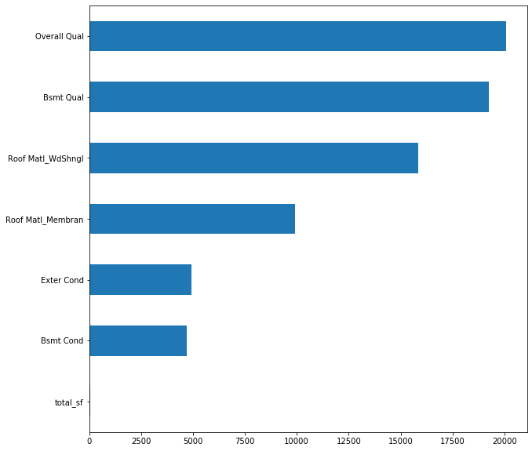
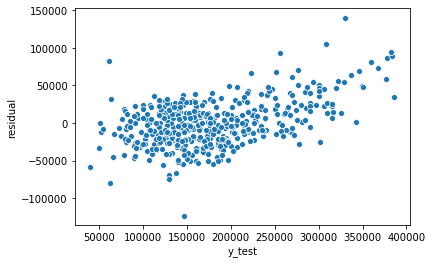



## Project 1 : Ames Housing Data

Author: Yan Long

## Executive Summary
The Ames Housing Dataset was introduced in 2011 as a sandbox for fledging data scientist. The 2,919 observations of housing sales in Ames, Iowa spans over 2006 to 2010 with 80 features that gives a comprehensive handbook about each house’s size, quality, area, age, and other miscellaneous attributes.

## Problem Statement
We want to identify the factors involved such as housing size and type of neighbourhood and use it to predict the sale price of a house in Ames, Iowa.

## Contents
- [Data Dictionary](#Data-Dictionary)
- [Modelling](#Modelling)
- [Recommendations](#Recommendations)

## Data Dictionary
Most feature description are given by [Ames, Iowa Assessor’s Office](http://jse.amstat.org/v19n3/decock/DataDocumentation.txt). Additional traits used will be shown below.

|Feature|Type|Dataset|Description|
|---|---|---|---|
|ames|DataFrame|train|Data provided by Ames, Iowa Assessor's Office|
|test|DataFrame|test|Test data given by Kaggle Challenge to access model scoring|
|num_col|List|ames|List for numeric variables in Dataset|
|objects_col|List|ames|List for categorical variables in Dataset|
|fill_missing_num|Function||Inputer functions for num_col|
|fill_missing_obj|Function||Inputer functions for objects_col|
|total_sf|List|ames|Column created from summing continuous sq_feet parameter in ames (AbvGrd and BelowGrd)|
|total_room_plus_baths|List|ames|Column created from summing room and baths parameter in ames (AbvGrd and BelowGrd)|


## Modelling
We convert various variables that are ordinal into floats and used it in the regression instead of creating dummies to minimise variables introduced to the model. Using correlation and visual interpretation along with RFE+Lasso to drop most of the other variables, we have constructed a model using the below coefficients with the Ridge model. Total results in in 8 significant factors that converge to 0 (although magnitude might not be large).



Below also shows the residual plots that demonstrate the prediction of the model. The distribution shows that this model will break down at higher housing prices but prices of housing in that range is far and few. 



Locational impact on pricing seems not to be very relevant in the context of ames. In fact, negative factors does not even appear in the model.

## Recommendations
Better quality houses are sold for a higher price and no negative features were found to be of significant impact on prices. Additional data on buyers if provided could be included into the dataset us identify identify their market audience for developers.


```python

```
