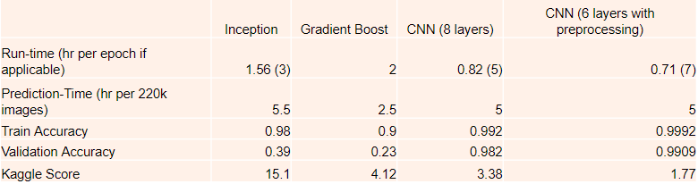



## Capstone

Author: Yan Long

## Problem Statement
Statefarm, an insurance company, wants to be able to revise their premiums for car insurance as accurately as possible and thus wants to identify the states of the driver when driving. For example differentiating whether they are: on the phone,eating or just simply driving safely. The dataset they have collected are separated into the groupings on the file with a main file that serves like a directory for the images. This is a multiclass image classification problem

## DataSet
Dataset is from the kaggle challenge in the link provided: https://www.kaggle.com/c/state-farm-distracted-driver-detection/data. Only the train data is included in the repo
Note: In the directory in the test file, you will need to create another subdirectory to house all the test files (ie. ur image should rest in  state_farm_.../test/test/img_XX.img and not just state_farm_.../test/img_XX.jpg)
## Contents
- [Modelling](#Modelling)
- [Recommendations](#Recommendations)
- [Deployment](#Deployment)

## Modelling
We made 4 models. Trained inception model, ensemble classifier, vanilla cnn and cnn with preprocessed input(background removal techiqnues)



Ultimately, the accuracy and runtime considerations made the final model of choice to be the preprocessed cnn

## Recommendations
Further transformation on the images can be researched on augmented channels and different preprocessing for the image for this situation. Also further segregation of states to more granular state could be another approach to classifier the images.

## Deployment
Attached in the project is a zip file that uses django to write the webapp for application of the model

## Personal learning point
<ul>
<li>Pretrained Model =/= Plug-and-Play </li>
<li>Always a good practice to check time -- especially for training and predictions (%%time)</li>
</ul>

```python

```
