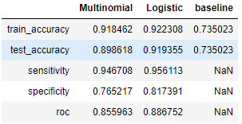
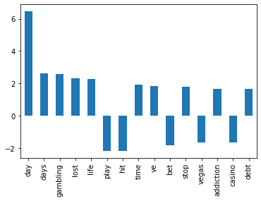



## Project 3: Reddit Scrapping

Author: Yan Long

## Problem Statement
Using Multinomial Naive Bayes or Logistic Regression, we want to be able to classify 2 subreddits 'r/problem gambling' and 'r/gambling' to tell when an individual has been addicted to it. This is very useful for individuals to self-diagnose themselves whether their habitual gambling has gotten out of hand.

## Contents
- [Modelling](#Modelling)
- [Recommendations](#Recommendations)


## Modelling
We made 2 models using the Multinomial Naive Bayes with CountVectorizer and Logistic Regression with TFIDF with the scores shown below.



Ultimately, we chose Logistic Regression as we favoured higher sensitivity score. Below are some terms that showed some of the word features and the coefficients.



## Recommendations
We can try to get more data samples from a more local agency such as from NCPG to make it generalize better to a local context. We can also futher research on using reddit to assess how useful is keeping track of no-gambling days in changing a problem gambler's habit.

```python

```
