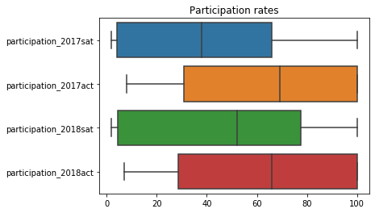
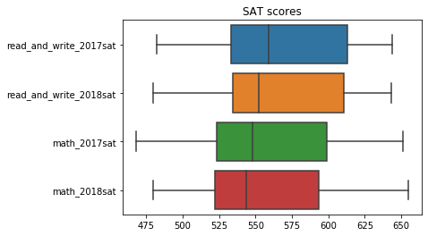

## Project 1 : SAT & ACT Analysis

Author: Yan Long

---

## Executive Summary
For a long time, SAT and ACT have been in a tug-of-war to be the go-to college exams for high school students. College board or more recognisably known as SAT has shown increasing participation rate from students across the states. More opportunities seems to available as national state exams such as PARCC and Smarter Balanced starts to have students opting out of the program. Here, we explore at the test data for both in 2017 and 2018.

## Problem Statement
To identify potential states and provide reccommendations for the College board to boost their particpation rate

## Contents
- [Data Dictionary](#Data-Dictionary)
- [Graphs and Plots](#Graphs-and-Plots)
- [Recommendations](#Recommendations)
- [References](#References)

## Data Dictionary
|Feature|Type|Dataset|Description|
|---|---|---|---|
|act2017|DataFrame|2017 ACT|DataFrame from ACT in 2017|
|act2018|DataFrame|2018 ACT|DataFrame from ACT in 2018|
|sat2017|DataFrame|2017 SAT|DataFrame from SAT in 2017|
|sat2018|DataFrame|2018 SAT|DataFrame from SAT in 2018|
|state|object|act2018|All 50 American states in 2018|
|participation_2017sat|float|sat2017|Participation rates for SAT tests in 2017| 
|read_and_write_2017act|float|sat2017|Average scores for the evidence-based reading and writing segment of the SAT in 2017| 
|math_2017sat|float|sat2017|Average scores for the math segment of the SAT in 2017| 
|total_2017sat|float|sat2017|Average total scores for the SAT in 2017|
|participation_2017act|float|act_2017|Participation rates for ACT in 2017| 
|english_2017act|float|act2017|Average english scores for the ACT in 2017| 
|math_2017act|float|act2017|Average math scores for the ACT in 2017| 
|reading_2017act|float|act2017|Average reading scores for the ACT in 2017|
|science_2017act|float|act2017|Average science scores for the ACT in 2017| 
|composite_2017act|float|act2017|Average composite scores for the ACT in 2017| 
|participation_2018sat|float|sat2018|Participation rates for SAT tests in 2018| 
|read_and_write_2018act|float|sat2018|Average scores for the evidence-based reading and writing segment of the SAT in 2018| 
|math_2018sat|float|sat2018|Average scores for the math segment of the SAT in 2018| 
|total_2018sat|float|sat2018|Average total scores for the SAT in 2018|
|participation_2018act|float|act2018|Participation rates for ACT in 2018| 
|english_2018act|float|act2018|Average english scores for the ACT in 2018| 
|math_2018act|float|act2018|Average math scores for the ACT in 2018| 
|reading_2018act|float|act2018|Average reading scores for the ACT in 2018|
|science_2018act|float|act2018|Average science scores for the ACT in 2018| 
|composite_2018act|float|act2018|Average composite scores for the ACT in 2018| 

## Graphs and Plots

The boxplot above shows the yearly partcipation rates of the sat where participation rate mean has shown to improve, while the contrary happens to ACT.
 
We also notice a state with low participation rate for both SAT and ACT in the 2 years which can be a very compelling state to promote SAT on with the uptapped market.

The scores variation for the SAT papers

## Recommendations
Based on online research and given data, I would recommend working on Oregon based on the data where there is a huge opportunity to increase participation rate in a state since participation rate are currently low (<50%). Moreover, it is the 25th most populous state in which meant efforts in increasing the participation rate would likely meant a good number of students taking up the test while not facing severe competition from ACT which only shows a student participation rate of 42% in 2018.

## References
Colorado Juniors Face New, Revamped College Exam in Sat After State Dumps Rival Act,Monte Whaley - https://www.denverpost.com/2017/03/06/colorado-juniors-sat-college-exam/ 

Who Is Left In Parcc and Smarter Balanced?,Oak-Shane Hart - https://truthinamericaneducation.com/common-core-assessments/who-is-left-in-parcc-and-smarter-balanced/

Oregon Decides To Keep High School State Tests,Rob Manning - https://www.opb.org/news/article/oregon-high-school-state-tests/

